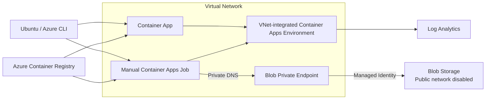

# Azure Deployment Plan

> **Status:** Validated

Generated: 2026-09-07

---

## 1. Project Overview

**Goal:** Azure 超初心者が Ubuntu から Azure Container Apps と Container Apps Jobs を構築し、通常アプリの動作確認、Job の正常完了、監視、結果確認、実行途中の停止と停止確認まで再現できる教材を作成する。

**Path:** New Project

---

## 2. Requirements

| Attribute | Value |
|-----------|-------|
| Classification | POC / 学習用ハンズオン |
| Scale | Small |
| Budget | Cost-Optimized |
| Subscription | 読者が実習時に自分のサブスクリプションを選択（本作業ではデプロイしない） |
| Location | `japaneast` を例示し、変数で変更可能（本作業ではデプロイしない） |
| Client OS | Ubuntu を主対象とする Linux |
| Compliance | 実データを扱わない学習用途 |

---

## 3. Components

| Component | Type | Technology | Path |
|-----------|------|------------|------|
| 基礎教材 | Documentation | Markdown | `docs/01-fundamentals.md` |
| 通常 App 実習 | Documentation | Markdown + Azure CLI | `docs/02-container-app.md` |
| Jobs 基礎教材 | Documentation | Markdown + Azure CLI | `docs/03-jobs-basics.md` |
| Jobs 実習 | Documentation | Markdown + Azure CLI | `docs/04-simulation-lab.md` |
| シミュレーター | Worker | Python | `src/simulation/` |
| コンテナー定義 | Container | Dockerfile | `src/simulation/Dockerfile` |
| 補助スクリプト | Operations | Bash | `scripts/` |

---

## 4. Recipe Selection

**Selected:** Azure CLI

**Rationale:** 初心者が各 Azure リソースと操作の関係を追えるよう、最初の実習は Azure CLI を一手順ずつ実行する。コード化された再現性より概念理解を優先しつつ、変数化した Bash コマンドでタイプミスを減らす。

---

## 5. Architecture

**Stack:** Azure Container Apps / Serverless Containers

| Component | Azure Service | SKU / Mode |
|-----------|---------------|------------|
| Web サンプル | Azure Container Apps | Consumption |
| Simulation Job | Azure Container Apps Jobs | Manual / Consumption |
| Container image | Azure Container Registry | Basic |
| Job results | Azure Blob Storage | Standard_LRS |
| Private network | Azure Virtual Network | Container Apps Subnet + Private Endpoint Subnet |
| Private access | Azure Private Link / Private DNS | Blob Private Endpoint |
| Central logs | Log Analytics workspace | Pay-as-you-go |
| Authentication | Managed Identity + Azure RBAC | System-assigned |

---

## 6. Provisioning Limit Checklist

このターンでは教材ファイルのみを生成し、Azure リソースを実際にはデプロイしないため、現在のサブスクリプション使用量・リージョン容量の検証は対象外。教材内で、実習前に対象サブスクリプションの Azure Container Apps 環境数、Managed Environment Consumption cores、ACR、Storage の利用可否を確認する手順を案内する。

| Resource Type | Number in Tutorial | Deployment in This Work | Limit/Quota | Notes |
|---------------|--------------------|-------------------------|-------------|-------|
| `Microsoft.App/managedEnvironments` | 1 | 0 | N/A | 読者が実習時に確認 |
| `Microsoft.App/containerApps` | 1 | 0 | N/A | 読者が実習時に作成 |
| `Microsoft.App/jobs` | 1 | 0 | N/A | 読者が実習時に作成 |
| `Microsoft.ContainerRegistry/registries` | 1 | 0 | N/A | 読者が実習時に作成 |
| `Microsoft.Storage/storageAccounts` | 1 | 0 | N/A | 読者が実習時に作成 |
| `Microsoft.OperationalInsights/workspaces` | 1 | 0 | N/A | 読者が実習時に作成 |
| `Microsoft.Network/virtualNetworks` | 1 | 0 | N/A | 専用 Subnet を2つ作成 |
| `Microsoft.Network/privateEndpoints` | 1 | 0 | N/A | Blob subresource 用 |
| `Microsoft.Network/privateDnsZones` | 1 | 0 | N/A | `privatelink.blob.core.windows.net` |

**Status:** 教材生成のみのため Azure 容量消費なし

---

## 7. Security

- Azure CLI のログインとサブスクリプション選択を明示する。
- シークレットや接続文字列をソースコードへ保存しない。
- Job から Blob Storage への書き込みには Managed Identity と最小権限 RBAC を使う。
- Container Apps Environment を VNet 統合し、Storage の公開ネットワークアクセスを無効化する。
- Blob Storage へのデータ通信は Private Endpoint と Private DNS を経由する。
- Blob コンテナーの初期作成は VNet 外からデータプレーンへ接続せず、ARM 管理プレーンを使う。
- ACR の管理者アカウントは有効化せず、Azure CLI の ACR Build と Managed Identity による Pull を使う。
- 学習後はリソースグループ単位で削除できる構成にする。

---

## 8. Validation

- Markdown 内の相対リンクを検査する。
- Bash スクリプトを `bash -n` で検査する。
- Python を `python3 -m compileall` とローカル短時間実行で検査する。
- Dockerfile を利用可能な場合に `docker build` で検査する。
- Azure CLI コマンドは公式ドキュメントの現行構文と照合する。
- 実 Azure デプロイはこの作業では行わない。

### Validation Proof

| Check | Command / Method | Result | Date |
|-------|------------------|--------|------|
| Bash syntax | `bash -n scripts/check-prerequisites.sh scripts/set-env.sh.example` | Pass | 2026-09-07 |
| Python syntax | `python3 -m compileall -q src/simulation` | Pass | 2026-09-07 |
| Prerequisite script | `./scripts/check-prerequisites.sh` | Pass | 2026-09-07 |
| Azure naming | Bash regex checks for generated ACR and Storage names | Pass | 2026-09-07 |
| Markdown links | Local Markdown target scan | Pass | 2026-09-07 |
| Container build | `docker build --tag containerapps-101-simulation:test src/simulation` | Pass | 2026-09-07 |
| Container dependencies | Azure Identity and Blob SDK import in built image | Pass | 2026-09-07 |
| Azure CLI surface | Help checks for Job create, identity, registry, update, start, execution, replica, logs, stop | Pass | 2026-09-07 |
| Private network CLI surface | Help checks for VNet, delegated subnet, private endpoint, private DNS link/zone group, management-plane `container-rm` | Pass | 2026-09-15 |
| VS Code diagnostics | Workspace diagnostics for `containerapps-101` | No errors | 2026-09-07 |

### Role Assignment Verification

- Job の system-assigned Managed Identity を principal として使用する。
- ACR に対する `AcrPull` はイメージ読み取りだけを許可し、ACR リソースにスコープする。
- `Storage Blob Data Contributor` は結果とcheckpointの読み書きに対応し、対象Storage Accountにスコープする。
- 接続文字列とACR管理者資格情報は使用しない。
- ABAC-enabled ACR の場合に `Container Registry Repository Reader` を使う注意をトラブルシューティングへ記載した。

### Not Applicable

- Bicep compile、ARM validate、what-if: この成果物は Azure CLI 学習教材であり、IaC テンプレートを生成しないため対象外。
- Azure Policy validation: この作業では Azure リソースをデプロイしないため対象外。実習先の組織ポリシーによってコマンドが拒否された場合は管理者へ確認する。

---

## 9. Files to Generate

| File | Purpose | Status |
|------|---------|--------|
| `.azure/deployment-plan.md` | 今回の計画 | 作成済み |
| `README.md` | 前提条件、学習順序、所要時間、コスト注意 | 承認後 |
| `docs/01-fundamentals.md` | 基礎概念 | 承認後 |
| `docs/02-container-app.md` | 通常の Container App 構築 | 承認後 |
| `docs/03-jobs-basics.md` | Jobs の基本 | 承認後 |
| `docs/04-simulation-lab.md` | 正常実行・監視・結果確認・途中停止 | 承認後 |
| `docs/06-enduser-job-execution-process.md` | 利用者の必要権限・投入・確認・取消手順 | 作成済み |
| `docs/07-troubleshooting-cleanup.md` | トラブル対応と後片付け | 承認後 |
| `src/simulation/simulation.py` | 進捗、SIGTERM、結果保存を実装 | 承認後 |
| `src/simulation/requirements.txt` | Python 依存関係 | 承認後 |
| `src/simulation/Dockerfile` | Job 用イメージ | 承認後 |
| `scripts/set-env.sh.example` | 実習用変数テンプレート | 承認後 |
| `scripts/check-prerequisites.sh` | ローカル前提条件チェック | 承認後 |

---

## 10. Execution Checklist

### Planning
- [x] 要件を整理
- [x] Azure リソースを実デプロイしないことを確認
- [x] Azure CLI ベースの教材構成を選択
- [x] アーキテクチャとセキュリティ方針を決定
- [x] ユーザーが計画を承認

### Content Generation
- [x] README と4章の Step-by-Step 教材を作成
- [x] シミュレーターと Dockerfile を作成
- [x] 前提条件チェックと環境変数テンプレートを作成
- [x] トラブルシューティングと後片付けを作成
- [x] ローカル検証を実行
- [x] Status を `Ready for Validation` に更新

### Deployment
- [ ] 本作業では実施しない。ユーザーが教材を使って明示的に実習する。

---

## 11. Next Step

ユーザー承認後、教材とサンプル実装を生成してローカル検証する。
