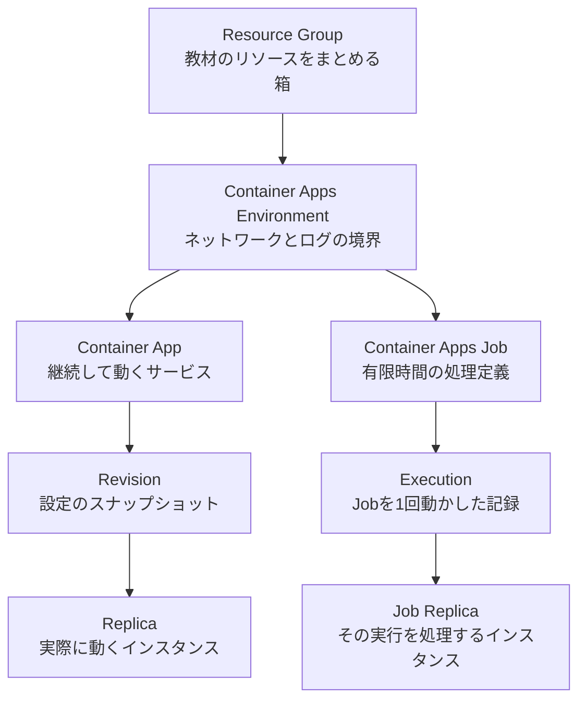

# 1. 最初におさえるポイント 

## 1-1. コンテナーについて

コンテナーは、アプリ本体と実行に必要なライブラリをひとまとめにした実行単位です。設計図に当たるファイルが `Dockerfile`、そこから作る読み取り専用のひな型が「コンテナーイメージ」、実際に起動したプロセスが「コンテナー」です。

Azure Container Apps は、サーバーや Kubernetes クラスターを直接管理せずにコンテナーを動かす Azure サービスです。

## 1-2. 登場するリソース



| 用語 | 初心者向けの意味 |
|---|---|
| Resource Group | 関連リソースをまとめて管理・削除する箱 |
| Container Apps Environment | 複数の App と Job が共有するネットワーク・ログ境界 |
| Container App | Web API のように継続して要求を待つ処理 |
| Revision | App のイメージや環境変数などを変更した時にできる設定の版 |
| Replica | Revision から起動された実際のコンテナー実行単位 |
| Job | バッチ処理のイメージ、CPU、メモリ、再試行などを定義したもの |
| Execution | Job を1回起動した実行履歴。複数回起動すれば複数できる |
| Job Replica | 1つの Execution 内で処理を担当するコンテナー実行単位 |

## 1-3. App と Job の選択

| 要件 | 選択 |
|---|---|
| HTTP 要求をいつでも受けたい | Container App |
| Queue を常時監視するワーカー | Container App |
| 1回の計算が終わったら停止したい | Container Apps Job |
| 毎晩レポートを作りたい | Schedule Job |
| Queue のメッセージごとに独立した計算をしたい | Event Job |

Job には Ingress がありません。Job は URL で待ち受けるサービスではなく、開始、処理、終了という有限のライフサイクルを持ちます。

## 1-4. Revision と Replica

App のコンテナーイメージや環境変数を変更すると、新しい Revision が作成されます。Revision は変更時点の設定を保持します。Replica は、その Revision を使って実際に起動したインスタンスです。

スケールアウトすると同じ Revision の Replica が増え、負荷が下がると減ります。最小 Replica 数を `0` にできる構成では、要求がない間はゼロまで減らせます。

## 1-5. ログの種類

| ログ | 内容 |
|---|---|
| Console log | コンテナーが標準出力・標準エラーへ書いた内容 |
| System log | Revision 作成、イメージ取得、Replica 起動などプラットフォームの内容 |
| HTTP log | Ingress の要求、応答コード、待ち時間。診断設定で有効化する |

問題が起きたら、まず System log でコンテナーが起動したか確認し、次に Console log でアプリ内部のエラーを確認します。

## 1-6. 認証の基本

パスワードや Storage 接続文字列をコンテナーへ直接埋め込まないことが基本です。この教材では Job に Managed Identity を付け、Azure RBAC で Blob への書き込み権限だけを与えます。

```text
Job -> Private DNS -> Blob Private Endpoint -> Managed Identity と Azure RBAC -> Blob Storage
```

ネットワーク到達性とアクセス権は別々に必要です。Private Endpoint と Private DNS が Blob までの閉域経路を作り、Managed Identity と Azure RBAC が Job に書き込みを許可します。Storage の公開ネットワークアクセスと Blob の匿名公開は無効にします。

## 確認ポイント

- Job と Execution の違いを理解。
- Revision と Replica の違いを理解。
- Web API と一度だけ行う計算における、App と Job の使い分けを理解。
- Console log と System log の用途を理解。

確認できたら、[2. 通常の Container App 構築](./02-container-app.md)へ進みます。
