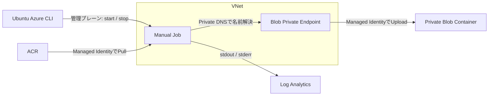

# 4. Container Apps Job でジョブを実行してみる

この章では Python のモンテカルロ法で円周率を近似する Job を作ります。5秒ごとに進捗を出し、正常終了時は `results/`、停止シグナル受信時は `checkpoints/` にJSONを書きます。

## 完成構成



## Step 1. 変数を読み直す

```bash
cd /home/hikurais/containerapps-101
source scripts/set-env.sh
az account show --output table
```

## Step 2. 閉域 Storage と結果用コンテナーを作る

Storage の公開ネットワークアクセスを無効にし、Container Apps の VNet からだけ到達できる Blob Private Endpoint を作ります。第2章で VNet 統合 Environment を作成済みであることが前提です。

```bash
az storage account create \
  --name "$STORAGE_ACCOUNT" \
  --resource-group "$RESOURCE_GROUP" \
  --location "$LOCATION" \
  --sku Standard_LRS \
  --kind StorageV2 \
  --min-tls-version TLS1_2 \
  --allow-blob-public-access false \
  --public-network-access Disabled \
  --output table

STORAGE_ID=$(az storage account show \
  --name "$STORAGE_ACCOUNT" \
  --resource-group "$RESOURCE_GROUP" \
  --query id --output tsv)

PRIVATE_ENDPOINT_SUBNET_ID=$(az network vnet subnet show \
  --name "$PRIVATE_ENDPOINT_SUBNET_NAME" \
  --resource-group "$RESOURCE_GROUP" \
  --vnet-name "$VNET_NAME" \
  --query id --output tsv)

az network private-endpoint create \
  --name "$STORAGE_PRIVATE_ENDPOINT_NAME" \
  --resource-group "$RESOURCE_GROUP" \
  --location "$LOCATION" \
  --subnet "$PRIVATE_ENDPOINT_SUBNET_ID" \
  --private-connection-resource-id "$STORAGE_ID" \
  --group-id blob \
  --connection-name "$STORAGE_PRIVATE_CONNECTION_NAME" \
  --output table

az network private-dns zone create \
  --name "$STORAGE_PRIVATE_DNS_ZONE" \
  --resource-group "$RESOURCE_GROUP" \
  --output table

VNET_ID=$(az network vnet show \
  --name "$VNET_NAME" \
  --resource-group "$RESOURCE_GROUP" \
  --query id --output tsv)

az network private-dns link vnet create \
  --name "$STORAGE_PRIVATE_DNS_LINK" \
  --resource-group "$RESOURCE_GROUP" \
  --zone-name "$STORAGE_PRIVATE_DNS_ZONE" \
  --virtual-network "$VNET_ID" \
  --registration-enabled false \
  --output table

STORAGE_PRIVATE_DNS_ZONE_ID=$(az network private-dns zone show \
  --name "$STORAGE_PRIVATE_DNS_ZONE" \
  --resource-group "$RESOURCE_GROUP" \
  --query id --output tsv)

az network private-endpoint dns-zone-group create \
  --name "$STORAGE_PRIVATE_DNS_GROUP" \
  --resource-group "$RESOURCE_GROUP" \
  --endpoint-name "$STORAGE_PRIVATE_ENDPOINT_NAME" \
  --private-dns-zone "$STORAGE_PRIVATE_DNS_ZONE_ID" \
  --zone-name blob \
  --output table
```

Blob コンテナーは Storage のデータプレーンではなく ARM 管理プレーンで作ります。実行端末が VNet 外でも、この方法なら Private Endpoint を経由せずに作成できます。

```bash
az storage container-rm create \
  --name "$RESULT_CONTAINER" \
  --storage-account "$STORAGE_ACCOUNT" \
  --resource-group "$RESOURCE_GROUP" \
  --public-access off \
  --output table
```

Private Endpoint 接続と公開ネットワーク設定を確認します。

```bash
az network private-endpoint show \
  --name "$STORAGE_PRIVATE_ENDPOINT_NAME" \
  --resource-group "$RESOURCE_GROUP" \
  --query '{privateIp:customDnsConfigs[0].ipAddresses[0], connection:privateLinkServiceConnections[0].privateLinkServiceConnectionState.status}' \
  --output table

az storage account show \
  --name "$STORAGE_ACCOUNT" \
  --resource-group "$RESOURCE_GROUP" \
  --query '{publicNetworkAccess:publicNetworkAccess, blobPublicAccess:allowBlobPublicAccess}' \
  --output table
```

Private Endpoint の `connection` が `Approved`、Storage の `publicNetworkAccess` が `Disabled` なら閉域設定は完了です。

## Step 3. ACR を作り、Azure 上でイメージをビルドする

```bash
az acr create \
  --name "$ACR_NAME" \
  --resource-group "$RESOURCE_GROUP" \
  --location "$LOCATION" \
  --sku Basic \
  --admin-enabled false \
  --output table

az acr build \
  --registry "$ACR_NAME" \
  --image "$SIMULATION_IMAGE" \
  src/simulation
```

`az acr build` はソースをACRへ送り、Azure側でDockerfileをビルドします。最後に `Run ID` と `Run Succeeded` が表示されることを確認します。

```bash
ACR_SERVER=$(az acr show \
  --name "$ACR_NAME" \
  --resource-group "$RESOURCE_GROUP" \
  --query loginServer --output tsv)

az acr repository show-tags \
  --name "$ACR_NAME" \
  --repository simulation \
  --output table
```

## Step 4. 公開イメージで Manual Job の器を作る

最初からprivate ACRイメージを指定すると、まだJobにIdentityがないためPullできません。まず公開イメージでJobを作成し、その後Identityと権限を設定してイメージを差し替えます。

```bash
az containerapp job create \
  --name "$JOB_NAME" \
  --resource-group "$RESOURCE_GROUP" \
  --environment "$CONTAINERAPPS_ENVIRONMENT" \
  --trigger-type Manual \
  --replica-timeout 600 \
  --replica-retry-limit 0 \
  --parallelism 1 \
  --replica-completion-count 1 \
  --image mcr.microsoft.com/k8se/quickstart-jobs:latest \
  --container-name simulation \
  --cpu 0.5 \
  --memory 1Gi \
  --output table
```

## Step 5. Job に Managed Identity を付ける

このStepと次のRBAC設定は管理者による初期構築作業です。同じJobのExecutionを開始するたびに行う必要はありません。構築後の利用者操作と必要権限は[第6章](./06-enduser-job-execution-process.md)を参照してください。

```bash
JOB_PRINCIPAL_ID=$(az containerapp job identity assign \
  --name "$JOB_NAME" \
  --resource-group "$RESOURCE_GROUP" \
  --system-assigned \
  --query principalId --output tsv)

echo "$JOB_PRINCIPAL_ID"
```

このIDはパスワードではなく、Jobを表すMicrosoft Entra上のIDです。

## Step 6. ACR Pull と Blob 書き込みを許可する

```bash
ACR_ID=$(az acr show \
  --name "$ACR_NAME" \
  --resource-group "$RESOURCE_GROUP" \
  --query id --output tsv)

STORAGE_ID=$(az storage account show \
  --name "$STORAGE_ACCOUNT" \
  --resource-group "$RESOURCE_GROUP" \
  --query id --output tsv)

az role assignment create \
  --assignee-object-id "$JOB_PRINCIPAL_ID" \
  --assignee-principal-type ServicePrincipal \
  --role AcrPull \
  --scope "$ACR_ID"

az role assignment create \
  --assignee-object-id "$JOB_PRINCIPAL_ID" \
  --assignee-principal-type ServicePrincipal \
  --role "Storage Blob Data Contributor" \
  --scope "$STORAGE_ID"
```

RBAC の反映には数分かかる場合があります。Job が最小権限で何を許可されたか確認します。

`--all` を付けて、ACR・Storageなど個別リソースのスコープへの割り当ても表示します。省略すると既定ではサブスクリプションスコープのみが対象となり、割り当て済みでも何も表示されない場合があります。

```bash
az role assignment list \
  --assignee "$JOB_PRINCIPAL_ID" \
  --all \
  --query '[].{role:roleDefinitionName, scope:scope}' \
  --output table
```

## Step 7. Job にprivate ACRとシミュレーターを設定する

```bash
az containerapp job registry set \
  --name "$JOB_NAME" \
  --resource-group "$RESOURCE_GROUP" \
  --server "$ACR_SERVER" \
  --identity system

az containerapp job update \
  --name "$JOB_NAME" \
  --resource-group "$RESOURCE_GROUP" \
  --container-name simulation \
  --image "$ACR_SERVER/$SIMULATION_IMAGE" \
  --set-env-vars \
    AZURE_STORAGE_ACCOUNT_URL="https://$STORAGE_ACCOUNT.blob.core.windows.net" \
    RESULT_CONTAINER="$RESULT_CONTAINER" \
    SIMULATION_STEPS=24 \
    STEP_SECONDS=5 \
    SAMPLES_PER_STEP=100000 \
  --output table
```

URL は通常の `blob.core.windows.net` を使います。VNet にリンクした `privatelink.blob.core.windows.net` Private DNS zone により、Job 内では同じホスト名が Private Endpoint のプライベート IP へ解決されます。`privatelink` のホスト名をアプリへ直接設定しません。

24 step x 5秒なので、正常時は約2分で完了します。

```bash
az containerapp job show \
  --name "$JOB_NAME" \
  --resource-group "$RESOURCE_GROUP" \
  --query '{trigger:properties.configuration.triggerType, timeout:properties.configuration.replicaTimeout, retry:properties.configuration.replicaRetryLimit, image:properties.template.containers[0].image, identity:identity.type}' \
  --output yaml
```

## シナリオA: 実行、監視、結果確認

### Step A1. Job を開始する

```bash
EXECUTION_NAME=$(az containerapp job start \
  --name "$JOB_NAME" \
  --resource-group "$RESOURCE_GROUP" \
  --query name --output tsv)

echo "Execution: $EXECUTION_NAME"
```

空の場合は一覧から最新実行名を取得します。

```bash
EXECUTION_NAME=${EXECUTION_NAME:-$(az containerapp job execution list \
  --name "$JOB_NAME" \
  --resource-group "$RESOURCE_GROUP" \
  --query 'sort_by(@,&properties.startTime)[-1].name' --output tsv)}
```

### Step A2. Execution 状態を見る

```bash
az containerapp job execution list \
  --name "$JOB_NAME" \
  --resource-group "$RESOURCE_GROUP" \
  --query '[].{execution:name, status:properties.status, start:properties.startTime, end:properties.endTime}' \
  --output table
```

開始直後は `Running` です。

### Step A3. Replica とログを見る

Replica が作成されるまで少し待ってから実行します。

```bash
az containerapp job replica list \
  --name "$JOB_NAME" \
  --resource-group "$RESOURCE_GROUP" \
  --execution "$EXECUTION_NAME" \
  --output table

az containerapp job logs show \
  --name "$JOB_NAME" \
  --resource-group "$RESOURCE_GROUP" \
  --execution "$EXECUTION_NAME" \
  --container simulation \
  --follow \
  --format text
```

`progress` が増え、最後に `simulation_completed` と `result_uploaded` が出ます。ログ表示は Job 完了後に終了します。必要なら `Ctrl+C` でログ表示だけを終了できます。これはJob停止ではありません。

### Step A4. 成功状態を確認する

```bash
az containerapp job execution list \
  --name "$JOB_NAME" \
  --resource-group "$RESOURCE_GROUP" \
  --query "[?name=='$EXECUTION_NAME'].{execution:name,status:properties.status,start:properties.startTime,end:properties.endTime}" \
  --output table
```

`Succeeded` を確認します。

### Step A5. ログで結果保存を確認する

```bash
az containerapp job logs show \
  --name "$JOB_NAME" \
  --resource-group "$RESOURCE_GROUP" \
  --execution "$EXECUTION_NAME" \
  --container simulation \
  --tail 100 \
  --format text
```

`simulation_completed` の `status` が `succeeded`、`pi_estimate` が約3.14で、その後に `result_uploaded` と `results/$EXECUTION_NAME.json` が表示されれば成功です。Storage は閉域化されているため、VNet 外の実行端末から Blob の一覧取得やダウンロードは行いません。

## シナリオB: 実行、途中でKill、停止確認

### Step B1. 新しい Execution を開始する

```bash
KILL_EXECUTION_NAME=$(az containerapp job start \
  --name "$JOB_NAME" \
  --resource-group "$RESOURCE_GROUP" \
  --query name --output tsv)

echo "Kill target: $KILL_EXECUTION_NAME"
```

### Step B2. Running と進捗を確認する

```bash
az containerapp job execution list \
  --name "$JOB_NAME" \
  --resource-group "$RESOURCE_GROUP" \
  --query "[?name=='$KILL_EXECUTION_NAME'].{execution:name,status:properties.status,start:properties.startTime}" \
  --output table

az containerapp job logs show \
  --name "$JOB_NAME" \
  --resource-group "$RESOURCE_GROUP" \
  --execution "$KILL_EXECUTION_NAME" \
  --container simulation \
  --tail 30 \
  --format text
```

数回分の `progress` が表示されたら停止へ進みます。

### Step B3. 対象 Execution を停止する

```bash
az containerapp job stop \
  --name "$JOB_NAME" \
  --resource-group "$RESOURCE_GROUP" \
  --job-execution-name "$KILL_EXECUTION_NAME"
```

ここで削除されるのはJob定義ではなく、指定した1回のExecutionです。

### Step B4. 停止を管理面とログから確認する

管理面の状態:

```bash
az containerapp job execution list \
  --name "$JOB_NAME" \
  --resource-group "$RESOURCE_GROUP" \
  --query "[?name=='$KILL_EXECUTION_NAME'].{execution:name,status:properties.status,start:properties.startTime,end:properties.endTime}" \
  --output table
```

CLI/API バージョンによって最終状態の表記が異なる場合があるため、少なくとも `Running` ではないことを確認します。

ログ:

```bash
az containerapp job logs show \
  --name "$JOB_NAME" \
  --resource-group "$RESOURCE_GROUP" \
  --execution "$KILL_EXECUTION_NAME" \
  --container simulation \
  --tail 100 \
  --format text
```

停止タイミングに余裕があれば `termination_signal_received` と `checkpoint_uploaded` が表示されます。プラットフォーム都合で強制終了までの時間が短い場合、checkpoint 保存は保証されません。

`simulation_completed` と `result_uploaded` がなく、停止タイミングに余裕があった場合に `checkpoint_uploaded` があれば、完成済み結果を作らず途中状態を保存したことを確認できます。Storage は閉域化されているため、VNet 外の実行端末から Blob の一覧は取得しません。

### Step B5. Job 定義が残っていることを確認する

```bash
az containerapp job show \
  --name "$JOB_NAME" \
  --resource-group "$RESOURCE_GROUP" \
  --query '{name:name, state:properties.provisioningState, trigger:properties.configuration.triggerType}' \
  --output table
```

Job が表示されれば再実行可能です。

次は [5. KEDA オートスケール実習](./05-keda-autoscaling.md)へ進みます。
