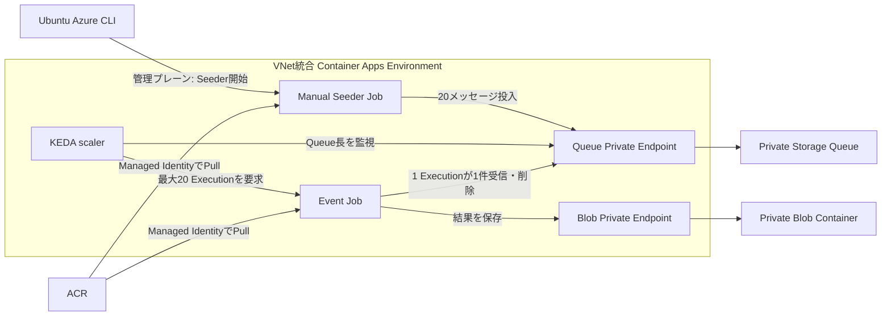

# 5. KEDA オートスケール実習

この章では、Azure Storage Queueへ20件の作業メッセージを投入し、KEDAがQueue長を監視してContainer Apps JobのExecutionを自動的に増減させる動きを確認します。

## このJobは何を実行するか

実処理はリポジトリ内の `src/keda-job/keda_job.py` に定義されています。`src/keda-job/Dockerfile` がこのPythonファイルと依存ライブラリをイメージへ格納し、コンテナー起動時に `python keda_job.py` を実行します。Step 4でイメージをACRへ登録し、Step 6とStep 7で同じイメージから2種類のJobを作ります。

| 区分 | 場所 | 内容 |
|---|---|---|
| Jobソース | `src/keda-job/keda_job.py` | Queueへの投入と、Queueから1件取得して処理するWorkerを定義する |
| イメージ定義 | `src/keda-job/Dockerfile` | Python、Azure SDK、Jobソースを実行可能なイメージにする |
| 依存ライブラリ | `src/keda-job/requirements.txt` | Managed Identity、Queue、Blobアクセスに使うAzure SDK |
| Azure上のEvent Job定義 | この章のStep 6 | KEDAルール、最大実行数、CPU、メモリ、Worker用環境変数を設定する |
| Azure上のSeeder Job定義 | この章のStep 7 | 20件を投入するManual JobとSeeder用環境変数を設定する |

同じPythonファイルを `RUN_MODE` で切り替えます。

| `RUN_MODE` | 呼び出す処理 | Jobの役割 |
|---|---|---|
| `seed` | `seed()` | `MESSAGE_COUNT`件の入力メッセージをQueueへ投入する |
| `worker` | `process_one()` | Queueから1件受信し、処理、結果保存、メッセージ削除を行う |

### 入力

入力はローカルのファイルではなく、閉域Azure Storage Queueに保存されるJSONメッセージです。Seeder Jobが次の形式で20件作成します。

```json
{"batch_id":"keda-lab-20","task_id":"task-01"}
```

`task_id`は `task-01` から `task-20` までです。KEDAはメッセージ本文を処理せず、Queueに残っているメッセージ数だけを監視します。起動されたWorkerが1件を受信します。

### Workerが行う処理

この教材のWorkerは、実際の業務計算の代わりに `PROCESS_SECONDS=120` 秒待機して、時間のかかる処理を模擬します。その後、入力の `batch_id` と `task_id`、Execution名、Replica名、完了時刻を結果JSONにしてBlobへ保存します。実際の計算や変換処理へ置き換える場合は、`src/keda-job/keda_job.py` の `process_one()`内に実装します。

### 出力

結果はローカルディスクではなく、第4章で作成した閉域Blobコンテナーへ直接保存します。

```text
$RESULT_CONTAINER/keda-results/<batch_id>/<task_id>.json
```

この実習で20件すべて成功すると、次のように20個のJSON Blobが作られます。

```text
simulation-results/
└── keda-results/
  └── keda-lab-20/
    ├── task-01.json
    ├── task-02.json
    ├── ...
    └── task-20.json
```

各結果には `status`、`completed_at`、`execution_name`、`replica_name`、`batch_id`、`task_id` が入ります。標準出力の `task_started`、`result_uploaded`、`task_completed` はLog Analyticsへ送られ、処理過程の確認に使います。Queueメッセージは結果保存後に削除されるため、処理完了後は入力Queueが空になります。

## この実習で確認すること

- KEDAは計算処理ではなく、イベント源を監視して必要な実行数を判断する
- Event JobはCLIから開始しなくても、Queueへの投入を契機に起動する
- 20メッセージに対して最大20個のExecutionが作られる
- 各Executionが1件を処理し、Queueが空になると新しいExecutionは起動されない
- 計算リソースは実行中だけ割り当てられ、待機中はExecutionがゼロになる

## 完成構成



KEDA、Seeder、Workerの役割を混同しないことが重要です。

| 要素 | この実習での役割 |
|---|---|
| KEDA | Queue長を10秒ごとに確認し、開始するExecution数を判断する |
| Seeder Job | 閉域VNet内からQueueへ20件投入して終了する |
| Event Job | KEDAに起動され、1 Executionにつき1件処理して終了する |
| Container Apps | ExecutionごとにCPU 0.5、メモリ1GiBのReplicaを配置する |

## スケール設定の読み方

この実習では次の値を使います。

| 設定 | 値 | 意味 |
|---|---:|---|
| `pollingInterval` | 10秒 | KEDAがQueueを確認する間隔 |
| `minExecutions` | 0 | Queueが空ならExecutionを常駐させない |
| `maxExecutions` | 20 | 1回のポーリングで起動するExecutionの上限 |
| `queueLength` | 1 | 1 Executionが担当する目標メッセージ数 |
| `parallelism` | 1 | 1 Execution内で同時に動くReplica数 |
| `replicaCompletionCount` | 1 | 1 Replica成功でExecutionを成功とする |

概念上、必要なExecution数はおおむね次のように決まります。

$$
\text{必要Execution数} = \min\left(20, \left\lceil\frac{\text{未処理メッセージ数}}{1}\right\rceil\right)
$$

20件投入直後は最大20、処理後にQueueが空になると0です。実際の起動は非同期なので、20個すべてが同じ瞬間に`Running`になるとは限りません。サブスクリプションのクォータ、環境容量、イメージ取得時間にも影響されます。

## Step 1. 前提リソースを確認する

第4章を完了し、ACR、閉域Storage、結果用Blobコンテナーが存在することを前提とします。

```bash
cd /home/hikurais/containerapps-101
source scripts/set-env.sh

az containerapp env show \
  --name "$CONTAINERAPPS_ENVIRONMENT" \
  --resource-group "$RESOURCE_GROUP" \
  --query '{state:properties.provisioningState,subnet:properties.vnetConfiguration.infrastructureSubnetId}' \
  --output yaml

az storage account show \
  --name "$STORAGE_ACCOUNT" \
  --resource-group "$RESOURCE_GROUP" \
  --query '{publicNetworkAccess:publicNetworkAccess,id:id}' \
  --output yaml
```

Environmentの`state`が`Succeeded`、`subnet`が空でないこと、Storageの`publicNetworkAccess`が`Disabled`であることを確認します。

## Step 2. Queueを管理プレーンから作成する

実行端末はVNet外にあるため、StorageのデータプレーンではなくARM管理プレーンでQueueを作ります。

```bash
STORAGE_ID=$(az storage account show \
  --name "$STORAGE_ACCOUNT" \
  --resource-group "$RESOURCE_GROUP" \
  --query id --output tsv)

az rest \
  --method put \
  --url "${STORAGE_ID}/queueServices/default/queues/${QUEUE_NAME}?api-version=2023-05-01" \
  --body '{}'
```

作成結果を管理プレーンで確認します。

```bash
az rest \
  --method get \
  --url "${STORAGE_ID}/queueServices/default/queues/${QUEUE_NAME}?api-version=2023-05-01" \
  --query '{name:name,type:type}' \
  --output table
```

## Step 3. Queue用Private EndpointとPrivate DNSを作る

BlobとQueueは別のStorageサブリソースなので、Queue用のPrivate EndpointとDNS zoneが必要です。

```bash
PRIVATE_ENDPOINT_SUBNET_ID=$(az network vnet subnet show \
  --name "$PRIVATE_ENDPOINT_SUBNET_NAME" \
  --resource-group "$RESOURCE_GROUP" \
  --vnet-name "$VNET_NAME" \
  --query id --output tsv)

az network private-endpoint create \
  --name "$QUEUE_PRIVATE_ENDPOINT_NAME" \
  --resource-group "$RESOURCE_GROUP" \
  --location "$LOCATION" \
  --subnet "$PRIVATE_ENDPOINT_SUBNET_ID" \
  --private-connection-resource-id "$STORAGE_ID" \
  --group-id queue \
  --connection-name "$QUEUE_PRIVATE_CONNECTION_NAME" \
  --output table

az network private-dns zone create \
  --name "$QUEUE_PRIVATE_DNS_ZONE" \
  --resource-group "$RESOURCE_GROUP" \
  --output table

VNET_ID=$(az network vnet show \
  --name "$VNET_NAME" \
  --resource-group "$RESOURCE_GROUP" \
  --query id --output tsv)

az network private-dns link vnet create \
  --name "$QUEUE_PRIVATE_DNS_LINK" \
  --resource-group "$RESOURCE_GROUP" \
  --zone-name "$QUEUE_PRIVATE_DNS_ZONE" \
  --virtual-network "$VNET_ID" \
  --registration-enabled false \
  --output table

QUEUE_PRIVATE_DNS_ZONE_ID=$(az network private-dns zone show \
  --name "$QUEUE_PRIVATE_DNS_ZONE" \
  --resource-group "$RESOURCE_GROUP" \
  --query id --output tsv)

az network private-endpoint dns-zone-group create \
  --name "$QUEUE_PRIVATE_DNS_GROUP" \
  --resource-group "$RESOURCE_GROUP" \
  --endpoint-name "$QUEUE_PRIVATE_ENDPOINT_NAME" \
  --private-dns-zone "$QUEUE_PRIVATE_DNS_ZONE_ID" \
  --zone-name queue \
  --output table
```

接続状態が`Approved`であることを確認します。

```bash
az network private-endpoint show \
  --name "$QUEUE_PRIVATE_ENDPOINT_NAME" \
  --resource-group "$RESOURCE_GROUP" \
  --query '{privateIp:customDnsConfigs[0].ipAddresses[0],connection:privateLinkServiceConnections[0].privateLinkServiceConnectionState.status}' \
  --output table
```

アプリには通常の`https://<account>.queue.core.windows.net`を設定します。VNetにリンクした`privatelink.queue.core.windows.net`がPrivate EndpointのIPへ名前解決します。

## Step 4. Queueワーカーのイメージをビルドする

第4章で作成したACRへ、SeederとWorkerが共用するイメージを追加します。

```bash
az acr build \
  --registry "$ACR_NAME" \
  --image "$KEDA_IMAGE" \
  src/keda-job

ACR_ID=$(az acr show \
  --name "$ACR_NAME" \
  --resource-group "$RESOURCE_GROUP" \
  --query id --output tsv)

ACR_SERVER=$(az acr show \
  --name "$ACR_NAME" \
  --resource-group "$RESOURCE_GROUP" \
  --query loginServer --output tsv)
```

## Step 5. KEDAとJobが使うManaged Identityを作る

KEDAのQueue長取得、SeederとWorkerのQueue操作、WorkerのBlob保存、ACR Pullに同じユーザー割り当てManaged Identityを使います。接続文字列やStorageキーは使いません。

```bash
az identity create \
  --name "$KEDA_IDENTITY_NAME" \
  --resource-group "$RESOURCE_GROUP" \
  --location "$LOCATION" \
  --output table

KEDA_IDENTITY_ID=$(az identity show \
  --name "$KEDA_IDENTITY_NAME" \
  --resource-group "$RESOURCE_GROUP" \
  --query id --output tsv)

KEDA_PRINCIPAL_ID=$(az identity show \
  --name "$KEDA_IDENTITY_NAME" \
  --resource-group "$RESOURCE_GROUP" \
  --query principalId --output tsv)

KEDA_CLIENT_ID=$(az identity show \
  --name "$KEDA_IDENTITY_NAME" \
  --resource-group "$RESOURCE_GROUP" \
  --query clientId --output tsv)
```

必要なデータプレーン権限とACR Pull権限を付与します。

```bash
az role assignment create \
  --assignee-object-id "$KEDA_PRINCIPAL_ID" \
  --assignee-principal-type ServicePrincipal \
  --role AcrPull \
  --scope "$ACR_ID"

az role assignment create \
  --assignee-object-id "$KEDA_PRINCIPAL_ID" \
  --assignee-principal-type ServicePrincipal \
  --role "Storage Queue Data Contributor" \
  --scope "$STORAGE_ID"

az role assignment create \
  --assignee-object-id "$KEDA_PRINCIPAL_ID" \
  --assignee-principal-type ServicePrincipal \
  --role "Storage Blob Data Contributor" \
  --scope "$STORAGE_ID"
```

RBACの反映には数分かかる場合があります。

## Step 6. KEDAで起動するEvent Jobを作る

```bash
az containerapp job create \
  --name "$KEDA_JOB_NAME" \
  --resource-group "$RESOURCE_GROUP" \
  --environment "$CONTAINERAPPS_ENVIRONMENT" \
  --trigger-type Event \
  --replica-timeout 300 \
  --replica-retry-limit 1 \
  --parallelism 1 \
  --replica-completion-count 1 \
  --min-executions 0 \
  --max-executions 20 \
  --polling-interval 10 \
  --scale-rule-name queue-length \
  --scale-rule-type azure-queue \
  --scale-rule-metadata \
    "accountName=$STORAGE_ACCOUNT" \
    "queueName=$QUEUE_NAME" \
    "queueLength=1" \
  --scale-rule-identity "$KEDA_IDENTITY_ID" \
  --image "$ACR_SERVER/$KEDA_IMAGE" \
  --container-name queue-worker \
  --cpu 0.5 \
  --memory 1Gi \
  --mi-user-assigned "$KEDA_IDENTITY_ID" \
  --registry-server "$ACR_SERVER" \
  --registry-identity "$KEDA_IDENTITY_ID" \
  --env-vars \
    RUN_MODE=worker \
    AZURE_CLIENT_ID="$KEDA_CLIENT_ID" \
    AZURE_STORAGE_QUEUE_URL="https://$STORAGE_ACCOUNT.queue.core.windows.net" \
    AZURE_STORAGE_ACCOUNT_URL="https://$STORAGE_ACCOUNT.blob.core.windows.net" \
    QUEUE_NAME="$QUEUE_NAME" \
    RESULT_CONTAINER="$RESULT_CONTAINER" \
    PROCESS_SECONDS=120 \
    VISIBILITY_TIMEOUT=300 \
  --output table
```

メッセージは処理結果をBlobへ保存した後で削除します。先に削除すると、KEDAは処理中のメッセージをQueue長として把握できず、正確なスケーリングや障害時の再処理ができません。

## Step 7. 20件を投入するSeeder Jobを作る

実行端末は閉域Queueへ到達できないため、VNet統合Environment内で動くManual Jobから投入します。

```bash
az containerapp job create \
  --name "$QUEUE_SEEDER_JOB_NAME" \
  --resource-group "$RESOURCE_GROUP" \
  --environment "$CONTAINERAPPS_ENVIRONMENT" \
  --trigger-type Manual \
  --replica-timeout 300 \
  --replica-retry-limit 1 \
  --parallelism 1 \
  --replica-completion-count 1 \
  --image "$ACR_SERVER/$KEDA_IMAGE" \
  --container-name queue-seeder \
  --cpu 0.25 \
  --memory 0.5Gi \
  --mi-user-assigned "$KEDA_IDENTITY_ID" \
  --registry-server "$ACR_SERVER" \
  --registry-identity "$KEDA_IDENTITY_ID" \
  --env-vars \
    RUN_MODE=seed \
    AZURE_CLIENT_ID="$KEDA_CLIENT_ID" \
    AZURE_STORAGE_QUEUE_URL="https://$STORAGE_ACCOUNT.queue.core.windows.net" \
    AZURE_STORAGE_ACCOUNT_URL="https://$STORAGE_ACCOUNT.blob.core.windows.net" \
    QUEUE_NAME="$QUEUE_NAME" \
    RESULT_CONTAINER="$RESULT_CONTAINER" \
    MESSAGE_COUNT=20 \
    BATCH_ID=keda-lab-20 \
  --output table
```

## Step 8. KEDA設定を確認する

20件投入前はEvent JobのExecutionが起動していなくても正常です。

```bash
az containerapp job show \
  --name "$KEDA_JOB_NAME" \
  --resource-group "$RESOURCE_GROUP" \
  --query '{trigger:properties.configuration.triggerType,min:properties.configuration.eventTriggerConfig.scale.minExecutions,max:properties.configuration.eventTriggerConfig.scale.maxExecutions,polling:properties.configuration.eventTriggerConfig.scale.pollingInterval,parallelism:properties.configuration.eventTriggerConfig.parallelism,rules:properties.configuration.eventTriggerConfig.scale.rules}' \
  --output yaml
```

次を確認します。

- `trigger`が`Event`
- `min`が`0`
- `max`が`20`
- `polling`が`10`
- ruleのtypeが`azure-queue`
- metadataの`queueLength`が`1`
- ruleのidentityにユーザー割り当てManaged IdentityのResource IDがある

## Step 9. 20件を投入する

```bash
SEED_EXECUTION_NAME=$(az containerapp job start \
  --name "$QUEUE_SEEDER_JOB_NAME" \
  --resource-group "$RESOURCE_GROUP" \
  --env-vars \
    RUN_MODE=seed \
    MESSAGE_COUNT=20 \
    BATCH_ID=keda-lab-20 \
  --query name --output tsv)

echo "Seeder execution: $SEED_EXECUTION_NAME"
```

Seederのログで20件投入を確認します。

```bash
az containerapp job logs show \
  --name "$QUEUE_SEEDER_JOB_NAME" \
  --resource-group "$RESOURCE_GROUP" \
  --execution "$SEED_EXECUTION_NAME" \
  --container queue-seeder \
  --follow \
  --format text
```

`message_enqueued`が20回表示され、最後に`seed_completed`と`"message_count": 20`が表示されれば投入完了です。

## Step 10. スケールアウトを観測する

KEDAは最大10秒ごとにQueueを確認します。次のコマンドを別ターミナルで実行すると、RunningとSucceededの変化を10秒間隔で確認できます。

```bash
for sample in {1..18}; do
  date -u '+%H:%M:%S UTC'
  az containerapp job execution list \
    --name "$KEDA_JOB_NAME" \
    --resource-group "$RESOURCE_GROUP" \
    --query '{running:length([?properties.status==`Running`]),succeeded:length([?properties.status==`Succeeded`]),failed:length([?properties.status==`Failed`]),total:length(@)}' \
    --output table
  sleep 10
done
```

`running`と`total`が増えるのがスケールアウトです。各ExecutionはCPU 0.5、メモリ1GiBを要求するため、20個がRunningなら最大でCPU 10、メモリ20GiB相当のReplicaが同時に配置されています。

Executionごとの状態も確認します。

```bash
az containerapp job execution list \
  --name "$KEDA_JOB_NAME" \
  --resource-group "$RESOURCE_GROUP" \
  --query '[].{execution:name,status:properties.status,start:properties.startTime,end:properties.endTime}' \
  --output table
```

起動直後に`Running`が20未満でも、すぐ異常とは判断しません。Execution作成、イメージ取得、Replica配置には時間差があります。

## Step 11. Replicaと処理ログを確認する

実行中または最新のExecution名を取得します。

```bash
KEDA_EXECUTION_NAME=$(az containerapp job execution list \
  --name "$KEDA_JOB_NAME" \
  --resource-group "$RESOURCE_GROUP" \
  --query 'sort_by(@,&properties.startTime)[-1].name' \
  --output tsv)

echo "$KEDA_EXECUTION_NAME"
```

そのExecutionのReplicaとログを確認します。

```bash
az containerapp job replica list \
  --name "$KEDA_JOB_NAME" \
  --resource-group "$RESOURCE_GROUP" \
  --execution "$KEDA_EXECUTION_NAME" \
  --output table

az containerapp job logs show \
  --name "$KEDA_JOB_NAME" \
  --resource-group "$RESOURCE_GROUP" \
  --execution "$KEDA_EXECUTION_NAME" \
  --container queue-worker \
  --tail 100 \
  --format text
```

ログは次の順序になります。

1. `task_started`: Queueから1件受信
2. `result_uploaded`: Blobへ結果保存
3. `task_completed`: Queueメッセージ削除

1 Executionが1件だけ処理して終了することを確認します。

## Step 12. 20件の完了とスケールインを確認する

```bash
az containerapp job execution list \
  --name "$KEDA_JOB_NAME" \
  --resource-group "$RESOURCE_GROUP" \
  --query '{running:length([?properties.status==`Running`]),succeeded:length([?properties.status==`Succeeded`]),failed:length([?properties.status==`Failed`]),total:length(@)}' \
  --output table
```

期待値は次のとおりです。

| 項目 | 期待値 |
|---|---:|
| `running` | 0 |
| `succeeded` | 20 |
| `failed` | 0 |
| `total` | 20 |

Queueが空になると、`minExecutions=0`なのでKEDAは新しいExecutionを起動しません。Job定義は残りますが、実行中Replicaはゼロです。これがEvent Jobのスケールインです。

履歴が20件を超える場合は、以前の実行が残っています。名前と開始時刻を含む一覧で今回分を確認してください。同じ`BATCH_ID`を再投入してもBlobは同じパスへ上書きされるため、結果保存は冪等です。

## 20個同時にRunningにならない場合

次の順で確認します。

1. Seederログに`seed_completed`と20件の投入がある
2. KEDA ruleの`queueLength=1`、`maxExecutions=20`、identityが正しい
3. Managed Identityに`Storage Queue Data Contributor`がある
4. Queue Private Endpointが`Approved`である
5. EnvironmentのSystem logにクォータや配置失敗がない

```bash
az role assignment list \
  --assignee "$KEDA_PRINCIPAL_ID" \
  --query '[].{role:roleDefinitionName,scope:scope}' \
  --output table

az containerapp env logs show \
  --name "$CONTAINERAPPS_ENVIRONMENT" \
  --resource-group "$RESOURCE_GROUP" \
  --tail 100
```

20件はKEDAへの入力です。実際の同時配置数はサブスクリプションのContainer Appsクォータと利用可能容量に制約されます。制約がある場合でも、Execution総数が最終的に20へ到達して全件成功すれば、KEDAによるイベント駆動処理は機能しています。

## 役割の振り返り

- Queueへ20件入れたのはSeeder Job
- Queue長を見て実行数を決めたのはKEDA
- CPUとメモリを使って処理したのは20個のJob Replica
- Queueが空になった後、新しいExecutionを作らなくしたのもKEDAの判断
- Job定義、履歴、Blob結果はスケールイン後も残る

次は [6. 問題解決と後片付け](./06-troubleshooting-cleanup.md)へ進みます。
