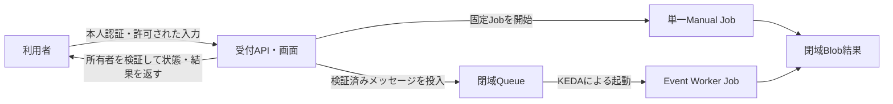

# 6. エンドユーザーのJob投入・確認・停止

この章では、管理者が[第4章](./04-simulation-lab.md)・[第5章](./05-keda-autoscaling.md)の構築を済ませた環境で、利用者が処理を依頼する手順を説明します。利用者がJob、Managed Identity、RBAC、ネットワークを毎回作る必要はありません。

## 最初に選ぶ利用方式

| 方式 | 対象者 | 利用者が行うこと | この教材での提供状況 |
|---|---|---|---|
| 受付API・画面経由（一般利用者に推奨） | JobのIdentityやSecretを直接利用させたくない人 | サインイン、入力送信、自分の受付IDで状態・結果確認、取消依頼 | 未実装。管理者の追加準備が必要。後述の運用手順を使用する |
| Azure CLIで既存Jobを直接開始 | JobのIdentity・Secretの利用を許可された信頼済み利用者 | 保存済みJobの開始、Execution確認、必要に応じて停止 | 第4章のManual Job、第5章のSeeder Jobをそのまま使用可能 |

**「Azureの管理者ではない」ことと「Jobの権限を安全に使える」ことは別です。** Job開始APIは実行時のイメージ・コマンド・環境変数の上書きを受け付けます。開始権限を持つ人は、コンテナーから利用可能なManaged Identityや、名前を知っているJob Secretを使えるため、開始権限を単なる「固定処理の実行ボタン」と考えないでください。

組み込みの `Container Apps Jobs Operator` と `Container Apps Jobs Contributor` は `Microsoft.App/jobs/*/action` を含み、Secret値を取得する `listSecrets/action` も許可します。カスタムロールでSecret一覧取得を除外しても、開始時の上書きによる利用リスクは残ります。一般利用者へ直接開始権限を渡さない要件なら、受付方式を選び、下記のCLI直接実行手順は配布しません。

## 管理者が事前に準備するもの

| 項目 | 単一Job（第4章） | スケーリングJob（第5章） |
|---|---|---|
| 保存済みJob定義 | `ca101-sim-job`、Manual、コンテナー `simulation` | `ca101-keda-job`、Event、コンテナー `queue-worker`。教材の投入役は `ca101-queue-seeder`、コンテナー `queue-seeder` |
| Identity | Jobのシステム割り当てIdentity | KEDA・Seeder・Workerに関連付けたユーザー割り当てIdentity |
| ワークロードの権限 | ACR Pull、結果Blobへの書き込み | ACR Pull、Queue監視・送受信、結果Blobへの書き込み |
| 閉域接続 | VNet、Blob Private Endpoint、Private DNS | 左記に加えてQueue Private Endpoint、Private DNS |
| 利用者への引き渡し | テナントID、サブスクリプションID、RG名、Job名、利用方式、問い合わせ先 | 左記に加えてEvent Job名、Seeder名、投入件数・バッチID、共有環境の利用ルール |
| 状態・結果閲覧 | 実行履歴、許可したログ、結果の閲覧方法 | バッチ・タスクとExecutionの対応、タスク別の成否・結果閲覧方法 |

Identityの関連付けとAzure RBACは初期構築・構成変更時の管理作業です。Executionが20個作られてもIdentityを20回設定しません。各実行は設定済みIdentityを使い、トークン取得・更新はAzureとSDKが処理します。Jobを削除して作り直す場合、システム割り当てIdentityは変わるため、管理者によるRBAC再設定が必要です。

第5章は学習用にIdentityを共用しています。本番では受付、Worker、スケーラー、イメージPullの必要権限に応じて分離し、対象Queue・Blobコンテナーなどにスコープを絞ります。利用者自身に `AcrPull` やBlob書き込み権限を与える必要はありません。

## 利用者に必要な権限

### 受付方式

利用者に必要なのは、受付アプリへのサインインと「処理依頼」「自分の状態・結果の閲覧」「自分の取消依頼」を許可するアプリ側の権限です。これらは管理者が実装する業務権限であり、同名のAzure組み込みロールが存在するわけではありません。

利用者にはJob開始・更新・削除、Identity割り当て、RBAC変更、Storageキー取得のAzure権限を与えません。受付バックエンドだけが、単一Jobの開始権限、または対象Queueへの投入権限を持ちます。JobのIdentityは利用者本人を表さないため、利用者ごとの認可を別途実装する必要があります。

### CLI直接実行方式（信頼済み利用者に限定）

管理者は利用者のEntraグループへ、必要な対象だけにカスタムロールを割り当てます。利用者自身はロールを作成・割り当てしません。

| 用途 | 必要な権限・スコープ |
|---|---|
| Job定義と実行履歴の参照 | 対象Jobで `Microsoft.App/jobs/read`、`Microsoft.App/jobs/executions/read`、`Microsoft.App/jobs/execution/read` |
| 単一Jobの開始 | Manual Jobで `Microsoft.App/jobs/start/action` |
| 教材の20件投入 | Seeder Jobで `Microsoft.App/jobs/start/action`。Event Workerの直接開始権限は不要 |
| 指定Executionの停止（許可する場合） | 対象Jobで `Microsoft.App/jobs/stop/execution/action`。全Execution停止用の `Microsoft.App/jobs/stop/action` は通常不要 |
| Environment参照 | 対象Environmentで `Microsoft.App/managedEnvironments/read`。Jobスコープの割り当てだけでは別リソースのEnvironmentへ適用されない |
| コンテナーログ閲覧 | 対象JobでActionの `Microsoft.App/jobs/getAuthToken/action` と、DataActionの `Microsoft.App/jobs/logstream/action` を許可。上記のJob・実行参照権限も必要 |
| 保存ログ閲覧（必要な場合） | 対象Log Analyticsの読み取り権限。`Log Analytics Reader` はワークスペース内の他のログも見える可能性があるため、共有環境では閲覧範囲を限定する |
| Blob結果の直接取得（任意） | 許可した結果コンテナーで `Storage Blob Data Reader` と、Blob Private Endpointへの到達性・DNS。コンテナー内の他利用者の結果も読めるため共用時は受付方式を優先 |

ログの `logstream/action` は末尾が `/action` でも、カスタムロールでは `Actions` ではなく `DataActions` に記載します。`getAuthToken/action` は `Actions` です。コンテナー内でコマンドを実行する `Microsoft.App/jobs/exec/action` はログ閲覧には付与しません。管理者は採用するCLI版で、利用者アカウントによる開始・実行履歴・Replica参照・ログ・必要な停止を事前検証してください。403に対してワイルドカード権限を追加するのではなく、不足操作とスコープを確認します。

Jobスコープの権限は「自分が開始したExecutionだけ」に制限されません。共有Jobで他人の履歴やログを見せない、他人の実行を停止させない要件がある場合も受付方式が必要です。`Owner`、RG全体の `Contributor`、`Role Based Access Control Administrator`、`Managed Identity Operator` を通常の利用者へ付与する必要はありません。

## 共通準備：CLI直接実行方式

以降のCLI手順は、上記リスクを承認された利用者が、管理者の完成済みリソースを使う場合だけ実施します。端末にはBash、Azure CLI、Container Apps拡張機能が必要です。拡張機能は管理者が検証した版を用意してください。

```bash
az version
az extension show --name containerapp --query version --output tsv
```

管理者から受領したテナント・サブスクリプションを指定し、**自分のアカウント**でログインします。管理者のログイン済みセッションを借りたり、JobのIdentityとしてログインしたりしません。`<...>` は受領値へ置き換えます。

```bash
az login --tenant "<管理者から受領したテナントID>" --use-device-code
az account set --subscription "<管理者から受領したサブスクリプションID>"
az account show --query '{subscription:id,name:name,user:user.name}' --output table

export RESOURCE_GROUP="rg-containerapps-101"
export JOB_NAME="ca101-sim-job"
export KEDA_JOB_NAME="ca101-keda-job"
export QUEUE_SEEDER_JOB_NAME="ca101-queue-seeder"
```

上記のリソース名も管理者から受領した値に合わせます。構築用スクリプトや第4・5章の `create`、`identity assign`、`role assignment create`、`job update` は再実行しません。別ターミナルを使う場合は、そのターミナルでも変数を設定してください。

Job開始・履歴取得はARM管理プレーンを使うため、端末がStorageのVNet外でも実施できます。ログ接続には組織のプロキシ・ネットワーク規則も適用されます。BlobやQueueの直接操作には、権限とは別にPrivate Endpointへの経路と名前解決が必要です。アクセスできない場合にStorageを公開設定へ変更しないでください。

## 単一Job：投入から確認・停止まで

### Step A1. 対象と入力を確認する

```bash
az containerapp job show \
  --name "${JOB_NAME:?Job名を設定してください}" \
  --resource-group "${RESOURCE_GROUP:?RG名を設定してください}" \
  --query '{name:name,trigger:properties.configuration.triggerType,state:properties.provisioningState}' \
  --output table
```

`Manual` と `Succeeded` を確認します。後者はリソース構築状態であり、処理結果ではありません。第4章のシミュレーターには入力ファイルはなく、管理者が保存した `SIMULATION_STEPS=24`、`STEP_SECONDS=5`、`SAMPLES_PER_STEP=100000` を使います。通常は約2分に起動時間が加わります。条件変更は管理者へ依頼し、利用者は任意のイメージやコマンドを渡しません。

### Step A2. 1回開始し、Execution名を控える

```bash
unset EXECUTION_NAME
if EXECUTION_NAME=$(az containerapp job start \
  --name "${JOB_NAME:?Job名を設定してください}" \
  --resource-group "${RESOURCE_GROUP:?RG名を設定してください}" \
  --query name --output tsv) && [[ -n "$EXECUTION_NAME" ]]; then
  printf 'Execution: %s\n' "$EXECUTION_NAME"
else
  unset EXECUTION_NAME
  printf '開始結果が不明です。再投入せず履歴と管理者への確認を行ってください。\n' >&2
fi
```

表示されたExecution名を記録します。開始に失敗した、または応答を受け取れなかった場合は後続手順へ進みません。`job execution list` で開始時刻を確認し、管理者と照合してください。無条件の再投入は重複実行を招きます。「一覧の最新」を自分のExecutionとして自動採用すると、他人の実行を誤認する危険があります。

### Step A3. 自分のExecutionとログを確認する

```bash
az containerapp job execution list \
  --name "$JOB_NAME" --resource-group "$RESOURCE_GROUP" \
  --query "[?name=='${EXECUTION_NAME:?A2で取得したExecution名が必要です}'].{execution:name,status:properties.status,start:properties.startTime,end:properties.endTime}" \
  --output table

az containerapp job logs show \
  --name "$JOB_NAME" --resource-group "$RESOURCE_GROUP" \
  --execution "${EXECUTION_NAME:?A2で取得したExecution名が必要です}" \
  --container simulation --tail 100 --format text
```

`Running` は実行中、`Succeeded` は成功、`Failed` は失敗です。表示が空なら反映待ちや対象違いを確認し、成功とは判断しません。ログの接続成功メッセージだけでも処理成功とは判断できません。監視を継続する場合は同じ確認コマンドを再実行します。`--follow` を追加したログ表示は `Ctrl+C` で終了できますが、Job自体は停止しません。

### Step A4. 結果を確認する

成功時はログに `simulation_completed`、約3.14の `pi_estimate`、`result_uploaded` が出ます。結果の場所は次のとおりです。

```text
<結果コンテナー>/results/<Execution名>.json
```

ログの保存成功表示と、Blob本体を取得して内容を確認したことは別です。成果物が必要なら管理者指定の閲覧方法を使います。後述の受付方式では結果画面から取得します。直接取得を許可された場合に限り、閉域接続済み端末で次を実行できます。

```bash
export STORAGE_ACCOUNT="<管理者から受領したStorage Account名>"
export RESULT_CONTAINER="<管理者から受領した結果コンテナー名>"
az storage blob download \
  --account-name "$STORAGE_ACCOUNT" --container-name "$RESULT_CONTAINER" \
  --name "results/${EXECUTION_NAME:?Execution名が必要です}.json" \
  --file "./${EXECUTION_NAME:?Execution名が必要です}.json" \
  --auth-mode login
```

### Step A5. 必要なら自分のExecutionだけ停止する

実行中の対象名をA3で再確認してから停止します。これは完了済み結果やJob定義の削除ではありません。

```bash
az containerapp job stop \
  --name "$JOB_NAME" --resource-group "$RESOURCE_GROUP" \
  --job-execution-name "${EXECUTION_NAME:?停止対象のExecution名が必要です}"
```

A3を再実行し、対象が `Running` でなくなったこととログを確認します。第4章の処理では停止タイミングによって `checkpoint_uploaded` と `checkpoints/<Execution名>.json` が残りますが、強制終了時の保存は保証されません。再開始は新しいExecutionによる最初からの計算であり、checkpointからの自動再開は実装されていません。

## スケーリングJob：投入から確認・取消まで

### Step B1. 投入内容と共有利用を確認する

利用者はEvent Workerを直接 `job start` しません。**Seederを1回開始してQueueへ20件投入し、Workerの起動はKEDAに任せます。**

```bash
az containerapp job show \
  --name "${QUEUE_SEEDER_JOB_NAME:?Seeder名を設定してください}" \
  --resource-group "$RESOURCE_GROUP" \
  --query '{name:name,trigger:properties.configuration.triggerType,env:properties.template.containers[0].env}' \
  --output yaml

az containerapp job show \
  --name "${KEDA_JOB_NAME:?Event Job名を設定してください}" \
  --resource-group "$RESOURCE_GROUP" \
  --query '{name:name,trigger:properties.configuration.triggerType,scale:properties.configuration.eventTriggerConfig.scale}' \
  --output yaml
```

教材のSeederは `MESSAGE_COUNT=20`、`BATCH_ID=keda-lab-20` に固定されています。入力は `{"batch_id":"keda-lab-20","task_id":"task-01"}` から `task-20` までです。Workerは1件ごとに120秒待機する模擬処理です。

**この固定バッチIDのまま複数利用者が同時投入する運用は避けます。** 同じIDを再投入すると結果パスが同じになり、既存結果を上書きします。投入前に管理者と実習時間・過去結果の扱いを確認してください。日常運用では受付側が一意なバッチIDを発行する仕組みが必要です。

### Step B2. Seederを1回だけ開始する

```bash
unset SEED_EXECUTION_NAME
if SEED_EXECUTION_NAME=$(az containerapp job start \
  --name "${QUEUE_SEEDER_JOB_NAME:?Seeder名を設定してください}" \
  --resource-group "${RESOURCE_GROUP:?RG名を設定してください}" \
  --query name --output tsv) && [[ -n "$SEED_EXECUTION_NAME" ]]; then
  printf 'Seeder execution: %s\n' "$SEED_EXECUTION_NAME"
else
  unset SEED_EXECUTION_NAME
  printf '投入結果が不明です。再投入せずSeeder履歴と管理者への確認を行ってください。\n' >&2
fi
```

`--env-vars` やテンプレート上書きは指定しません。表示されたSeeder Execution名、投入時刻、バッチIDを記録します。開始結果が不明な場合は、Seederの履歴を確認して管理者へ照合を依頼します。Seederは再試行や途中失敗でも一部メッセージを重複投入し得るため、失敗したように見えても直ちに再開始しません。

### Step B3. 投入の完了を確認する

```bash
az containerapp job execution list \
  --name "$QUEUE_SEEDER_JOB_NAME" --resource-group "$RESOURCE_GROUP" \
  --query "[?name=='${SEED_EXECUTION_NAME:?B2で取得したExecution名が必要です}'].{execution:name,status:properties.status,start:properties.startTime,end:properties.endTime}" \
  --output table

az containerapp job logs show \
  --name "$QUEUE_SEEDER_JOB_NAME" --resource-group "$RESOURCE_GROUP" \
  --execution "${SEED_EXECUTION_NAME:?B2で取得したExecution名が必要です}" \
  --container queue-seeder --tail 100 --format text
```

`message_enqueued` と、最後の `seed_completed`、`message_count: 20` を確認します。これは**投入完了**であり、Workerの20タスク完了ではありません。接続メッセージだけなら状態とログを再確認します。確認のためにSeederを再開始しないでください。

### Step B4. Workerの実行状態を確認する

```bash
az containerapp job execution list \
  --name "$KEDA_JOB_NAME" --resource-group "$RESOURCE_GROUP" \
  --query '[].{execution:name,status:properties.status,start:properties.startTime,end:properties.endTime}' \
  --output table

az containerapp job execution list \
  --name "$KEDA_JOB_NAME" --resource-group "$RESOURCE_GROUP" \
  --query '{running:length([?properties.status==`Running`]),succeeded:length([?properties.status==`Succeeded`]),failed:length([?properties.status==`Failed`]),total:length(@)}' \
  --output table
```

増減を観測したい場合は、投入前に別ターミナルで確認を始めます。KEDAのポーリング設定は10秒ですが、起動・配置にはさらに時間がかかります。同時に20個の `Running` が見えなくても異常とは限りません。

一覧・集計には過去分や他利用者の実行も含まれます。Execution一覧自体には業務の `batch_id` はなく、投入時刻だけでも自分のタスクだとは確定できません。Event Jobの成功・失敗履歴は直近100件までなので、長期・大量利用では受付側の管理台帳と保存ログが必要です。

一覧から調査対象のExecution名を指定し、ログの `batch_id` と `task_id` で照合します。1つのログ確認だけでバッチ全件の成功とは判断しません。

```bash
export KEDA_EXECUTION_NAME="<一覧で確認したWorkerのExecution名>"
az containerapp job logs show \
  --name "$KEDA_JOB_NAME" --resource-group "$RESOURCE_GROUP" \
  --execution "${KEDA_EXECUTION_NAME:?WorkerのExecution名が必要です}" \
  --container queue-worker --tail 100 --format text
```

### Step B5. タスク単位で結果を確認する

対象バッチの `task-01` から `task-20` について、`task_started`、`result_uploaded`、`task_completed` と結果JSONを照合します。結果の場所は次のとおりです。

```text
<結果コンテナー>/keda-results/<batch_id>/<task_id>.json
```

`Succeeded` が20件あることだけを完了条件にしません。空Queueから何も取得しなかったExecutionも正常終了し、再配信では同じタスクを複数Executionが処理する場合があります。`running=0` だけでも、失敗や残タスクがないことは証明できません。

成果物の内容まで確認する場合は、受付の結果画面、または許可された閉域端末を使います。次はA4と同じStorage設定・閲覧権限がある場合だけ実行します。

```bash
export BATCH_ID="keda-lab-20"
az storage blob list \
  --account-name "${STORAGE_ACCOUNT:?Storage名が必要です}" \
  --container-name "${RESULT_CONTAINER:?結果コンテナー名が必要です}" \
  --prefix "keda-results/${BATCH_ID:?バッチIDが必要です}/" \
  --auth-mode login --query '[].{name:name,modified:properties.lastModified}' \
  --output table

az storage blob download \
  --account-name "$STORAGE_ACCOUNT" --container-name "$RESULT_CONTAINER" \
  --name "keda-results/$BATCH_ID/task-01.json" \
  --file "./$BATCH_ID-task-01.json" --auth-mode login
```

ダウンロード例は1タスク分です。全件確認では20タスクすべての `status`、`batch_id`、`task_id`、`execution_name`、`completed_at` を確認します。固定バッチIDでは以前の20個が残っていることもあるので、個数だけで今回の完了とみなさないでください。

### Step B6. 取消が必要になった場合

Seeder停止はすでに投入したメッセージを取り消しません。また、WorkerのExecutionを停止しても未削除メッセージはvisibility timeout後に再び取得可能となり、KEDAが新しいExecutionを起動できます。したがって、**Execution停止とバッチ取消は別の操作**です。

この教材にはバッチ単位の取消機能はありません。利用者はバッチID、Seeder Execution名、判明しているWorker Execution名、投入時刻を添えて管理者へ取消を依頼します。共有Queueの全メッセージ削除、Event Jobの削除、スケール設定の変更はしません。

管理者から特定Workerの緊急停止を許可された場合だけ、対象バッチとの対応を確認して次を実行します。停止権限も事前付与が必要です。停止後はB4で状態を確認し、再配信の扱いを管理者と決めます。

```bash
az containerapp job stop \
  --name "$KEDA_JOB_NAME" --resource-group "$RESOURCE_GROUP" \
  --job-execution-name "${KEDA_EXECUTION_NAME:?停止するWorkerのExecution名が必要です}"
```

## 一般利用者向け：受付方式の運用手順

**この節の画面・API・受付ID管理・取消機能は、このリポジトリには未実装です。** 管理者が追加実装して提供するまで、この方式で投入はできません。架空のURLに対する実行コマンドは掲載しません。



### 管理者に依頼する準備

- 認証済みユーザーから所有者IDを決定し、サーバー側で受付ID・一意なバッチIDを発行する。利用者が送信した所有者IDを信用しない。
- 単一Jobは許可済みイメージ・コマンドを固定する。入力値の型・範囲・参照先を検証し、利用者指定のテンプレートをそのまま開始APIへ転送しない。
- スケーリングJobは検証済みタスクだけQueueへ投入する。受付バックエンドから閉域Queueへ接続できるようにする。
- 受付IDと所有者、Manual Executionまたはバッチ・タスク、処理状態、結果を管理台帳で関連付ける。リクエスト再送の重複抑止、件数上限、利用量制限、監査ログを用意する。
- 自分の受付だけを照会・取消・結果取得できるよう、すべてのAPIで所有者を検証する。共有Blobのパスを隠すだけでは認可にならない。
- バッチ取消は取消状態を保存し、Workerが処理前・結果確定前などに確認するよう変更する。実行中の処理、再配信、すでに完成した結果の扱いも定める。現行Workerはこの確認を実装していない。

### 単一Jobで利用者が行うこと

1. 管理者指定の受付URLへ自分のアカウントでサインインする。社内限定URLの場合はVPNなど指定経路を使う。
2. 「シミュレーション」を選び、許可された計算条件を入力して1回送信する。現在の第4章と同じ処理なら入力ファイルは不要。
3. 返された受付IDを控える。応答が不明な場合は自分の依頼一覧から照合し、無条件に再送しない。
4. 受付IDの状態を確認する。画面上の「受付済み」は計算成功ではなく、バックエンドの開始結果・実行状態と区別する。
5. 成功後、同じ受付IDの結果JSONを取得する。失敗時は受付IDとエラー表示を管理者へ伝える。
6. 必要なら同じ受付IDで取消を依頼し、取消完了または取消不能の理由を確認する。取消要求の受理だけで停止完了とは判断しない。

### スケーリングJobで利用者が行うこと

1. 受付URLへサインインし、許可されたタスク一覧を送信する。教材相当なら20件で、ユーザーがKEDAやWorkerを開始する操作は不要。
2. 受付ID・バッチID・受け付けたタスク数を控える。部分的な受付失敗を全件成功と誤認しない。
3. 自分のバッチの待機中・処理中・成功・失敗・取消件数を確認する。インフラのExecution数ではなく、タスクID単位の状態を使う。
4. 20件なら20タスクすべての最終状態を確認し、成功分の結果を取得する。再処理は受付が提供する失敗タスクの再依頼機能で行う。
5. 必要なら受付IDからバッチ取消を依頼する。未処理分、実行中分、完了済み分の扱いを確認し、最終状態まで追う。

いずれの利用者操作にもIdentityの関連付けやAzure RBACの変更は含まれません。

## 停止・削除・問い合わせの区別

| 操作 | 利用者の扱い |
|---|---|
| ログ表示終了 | `Ctrl+C`。処理自体は継続 |
| 実行中Executionの停止 | 許可された特定Executionのみ。定義や成果物は削除しない |
| バッチ取消 | 受付の取消機能を使用。現行教材では管理者へ依頼 |
| 受付記録・結果の削除 | 所有者確認・保存期間・監査ルールに従って受付または管理者へ依頼。取消とは別 |
| Job定義の削除 | 通常の利用者は行わない。次の実行や他利用者へ影響するため管理者が担当 |
| Resource Group・Queue・Identityの削除 | 管理者の後片付け。利用者の「自分のジョブ削除」として実行しない |

処理完了後は通常、Executionのコンテナーが終了するため、毎回Job定義を削除する必要はありません。ACR、Storage、Private Endpoint、ログなどの料金は別途残ります。

`AuthorizationFailed` が出たときは自分で管理者ロールを要求・付与するのではなく、対象サブスクリプション、Job名、操作名、エラー、発生時刻を管理者へ伝えます。処理問題では受付IDまたはExecution名、バッチID・タスクIDを添え、Secretやトークンは送らないでください。

ログ取得時にReplicaが消えている場合は、管理者が提供するLog Analyticsの保存ログ・閲覧画面を使います。`job logs show` は保存ログ全体の検索コマンドではありません。

## 公式資料

- [Container Apps Jobs：概念・権限・実行時上書き・履歴](https://learn.microsoft.com/azure/container-apps/jobs)
- [Managed Identity：ライフサイクルとコンテナーからの利用](https://learn.microsoft.com/azure/container-apps/managed-identity)
- [Azure CLI：Jobの開始・停止](https://learn.microsoft.com/cli/azure/containerapp/job?view=azure-cli-latest)
- [Azure CLI：Jobログ](https://learn.microsoft.com/cli/azure/containerapp/job/logs?view=azure-cli-latest)
- [Microsoft.Appの権限一覧：ActionsとDataActions](https://learn.microsoft.com/azure/role-based-access-control/permissions/compute#microsoftapp)

本章は公式仕様・ローカルCLIヘルプ・Bash構文・開始応答の模擬テストを確認しています。上記のカスタム権限だけを持つ利用者アカウントでのAzure実動作は未検証です。権限配布前に管理者が対象環境で検証してください。

次は [7. ジョブプロファイルの指定と留意点](./07-specify-job-profile.md)へ進みます。エラー調査や管理者向けのリソース変更・削除は[第8章](./08-troubleshooting-cleanup.md)を参照してください。